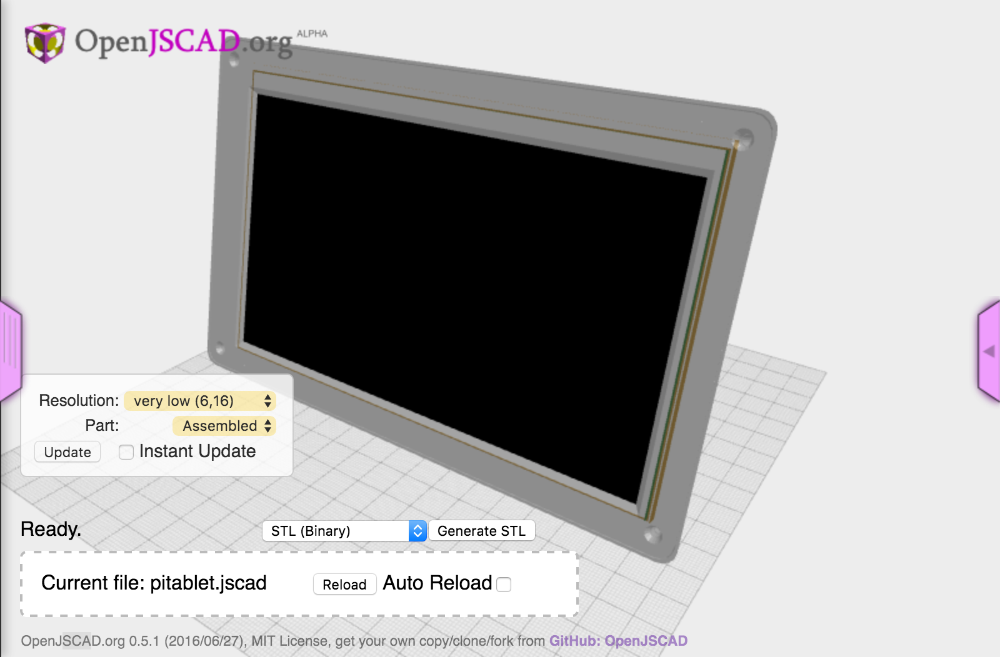
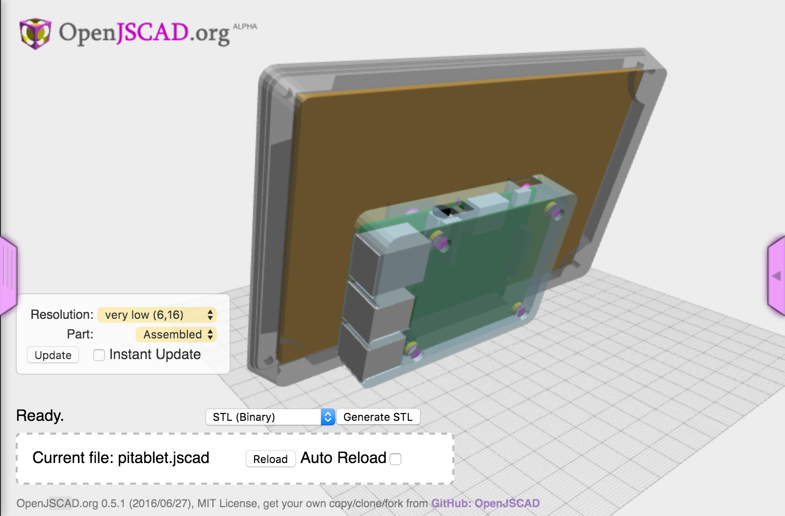

# pitablet

> RaspberryPi case for pi and 7 inch screen

- [Adafruit Kippah](https://www.adafruit.com/products/2453)
- [Display Extension](https://www.adafruit.com/products/2098)
- [7" LCD with Touchscreen](https://www.adafruit.com/products/2354)

[Open with OpenJSCAD](http://openjscad.org/#https://raw.githubusercontent.com/johnwebbcole/pitablet/master/dist/pitablet.jscad)

 

## Running

The jscad project `pitablet` uses gulp to create a `dist/pitablet.jscad` file and watches your source for changes. You can drag the `dist/pitablet.jscad` directory into the drop area on [openjscad.org](http://openjscad.org). Make sure you check `Auto Reload` and any time you save, gulp will recreate the `dist/pitablet.jscad` file and your model should refresh.

## License

ISC © [John Cole](http://github.com/johnwebbcole)
