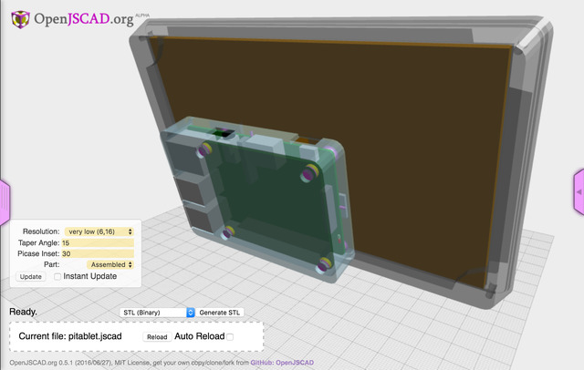
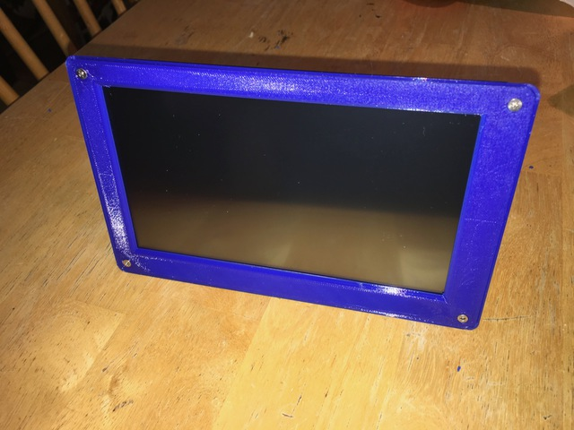

# pitablet

> Create a Raspberry Pi tablet with a 7-inch LCD touch screen from Adafruit. [Open with OpenJSCAD](http://openjscad.org/#https://raw.githubusercontent.com/johnwebbcole/pitablet/master/dist/pitablet.jscad)


# Why

Awhile back, I purchased an Adafruit Kippah board and a 7-inch LCD touchscreen, intending to use the RPi as a 5v computer to run my telescope. This was before the [Pi Foundation Display](https://www.raspberrypi.org/products/raspberry-pi-touch-display/) was available.

The screen worked great, but it didn't have any attachment tabs or a way of holding the RPi in place. Along with this problem, most of the software used with astrophotography was just being ported to the RPi, so I decided to shelve the project.

In the meantime, I added a 3D printer to my list of hobbies and began learning [OpenJSCAD](http://openjscad.org). When several programs I use with my telescope became available for RPi, I decided to combine the two hobbies and make my pitablet.


# Printing

This project uses OpenJSCAD, [jscad-utils](https://github.com/johnwebbcole/jscad-utils) and [jscad-raspberrypi](https://github.com/johnwebbcole/jscad-raspberrypi).

You can open the project directly in OpenJSCAD [here](http://openjscad.org/#https://raw.githubusercontent.com/johnwebbcole/pitablet/master/dist/pitablet.jscad)




## Generate STL Files

The three parameters on the left allow you to select:

- The resolution used to create cylinders and rounded edges.
- The angle of the taper on the edge of the tablet.
- Which part to view, assembled, bottom, top or picase.

When creating a STL file, set the resolution to the highest your system will allow. It can take a long time to render on the highest resolutions, but you will get a smoother object.

The taper angle will move the picase as well as changing the angle of the tablet edges. This allows the picase to act as a kick stand. The default works pretty well. Angles greater than 22 degrees don't stand upright well.

Select the part you want, then update. Then select the export type from the dropdown next to the `Generate STL` button, I use STL (ASCII), and press the Generate button.

Load the STL into your slicer. You may need to rotate the part to print well.

## Slicing

 The `bottom` should be printed with supports.

 The `top` and `picase` can be printed without supports.

 All three parts after printing and cleaning.

I printed these using ESun PETG filament.

## Parts

- [Adafruit Kippah](https://www.adafruit.com/products/2453)
- [Display Extension](https://www.adafruit.com/products/2098)
- [7-inch LCD with Touchscreen](https://www.adafruit.com/products/2354)
- 6-inch micro USB cable
- Raspberry Pi
- Micro SD card
- 4 M2.5x20mm screws
- 4 M2.5x4mm or M2.5x6mm screws
- 4 M2.5 nuts

## Load OS

Before you begin assembly, load the latest [Raspbian Jessie with Pixel](https://www.raspberrypi.org/downloads/raspbian/). You will need to configure using a HDMI monitor and keyboard/mouse. Once you have networking and ssh running, you can begin assembly. Once the Adafruit LCD is working, the HDMI port doesn't work anymore, and the case does not provide access to it.

Use `raspbi-config` to:

- Expand the file system
- Set the locals for keyboard, and language
- Set the timezone
- Enable ssh
- Auto login to desktop (optional)
- Enable VNC Server

If you have a Bluetooth keyboard/mouse, it's a good idea to get it connected now. I prefer [this](https://www.amazon.com/gp/product/B015J6TEN8/ref=oh_aui_detailpage_o07_s00?ie=UTF8&psc=1) one over [this](https://www.amazon.com/gp/product/B00EZL1IQA/ref=oh_aui_detailpage_o01_s02?ie=UTF8&psc=1), I find it easier to type on.

## Assembly


- Place the SD card with your configured raspbian image in your RPi.
- Put the Kippah board on the RPi.
- Attach the display extension ribbon cable to the Kippah board.
- Put the assembled RPi into the picase.


- Press the M2.5 nuts into the tablet bottom recesses.
- Feed the display extension ribbon cable into the tablet bottom.
- Use the 20mm M2.5 screws to attach the picase to the tablet bottom.


- Attach the display extension board to the LCD ribbon cable. The trick with the extension board is the tension bars flip up, not away as on the Kippah board. The extension board is much easier to connect to than the Kippah
- Use some scotch tape on both sides of the extension board to hold the board in place. Fold the tape over so it's easy to remove from the LCD (for the next step).


- Put the LCD in the tablet back so the extension ribbon cable can reach the extension board.
- Attach the extension ribbon to the extension board and tape it to the LCD so there is no flex on the LCD ribbon.


- Rotate the LCD so it's laying in the notches in the tablet bottom. Be careful not to twist the LCD ribbon cable. You will need to fold the extension ribbon cable in the gap below the LCD.



- Use the 4mm M2.5 screws to attach the tablet front. Make sure the notch for the LCD is clean as anything pressing on the LCD can cause issues with the touchscreen.


- Connect the 6-inch micro USB cable from the Kippah board, _not to the RPi power connection_.
- Connect a power cable and begin installation of the Kippah drivers.

## Installation

Follow the instructions on [Adafruit](https://learn.adafruit.com/adafruit-dpi-display-kippah-ttl-tft). If you have issues using the touchscreen calibration script, use `xinput-calibrator`.

```bash
sudo apt-get install xinput-calibrator
DISPLAY=:0.0 sudo xinput_calibrator
```

You need to place the settings into a calibration file. For Raspbian Jessie, use `/etc/X11/xorg.conf.d/99-calibration.conf`

You will need create the `xorg.conf.d` directory and place the config settings into a `99-calibration.conf` file.

```bash
sudo mkdir /etc/X11/xorg.conf.d
sudo nano /etc/X11/xorg.conf.d/99-calibration.conf
sudo reboot
```

## License

ISC © [John Cole](http://github.com/johnwebbcole)
